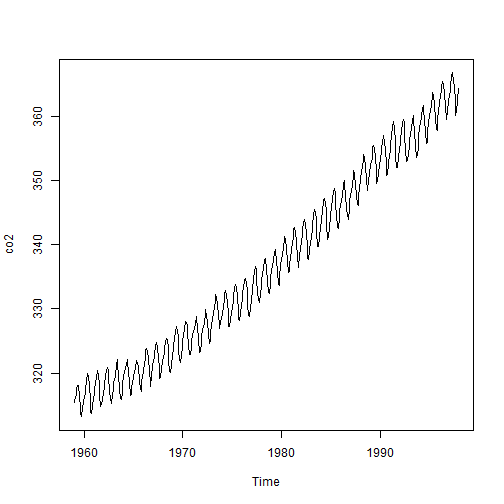

### CALCULATION METHOD FOR CARBON DI-OXIDE EMMISIONS
To calculate the CO2 emission from a fuel the carbon content of the fuel must be multiplied with the ratio of molecular weight CO2 (44) to the molecular weight Carbon 12 -> 44 / 12 = 3.7

Carbon Dioxide emission can be calculated as

qCO2 = cf / hf  CCO2/Cm         (1)

where

  - qCO2 = specific CO2 emission (CO2/kWh)
  - cf = specific carbon content in the fuel (kgC/kgfuel)
  - hf = specific energy content (kWh/kgfuel)
  - Cm = specific mass Carbon (kg/mol Carbon)
  - CCO2 = specific  mass Carbon Dioxide (kg/mol CO2)

---
### Normal carbon dioxide emmision with common fuels
Emission of Carbon Dioxide - CO2 - when combustion some common fuels are indicated in the table below.

Note! Heat loss - 55-75% - in power generation is not included in the numbers.   

Fuel  Specific Carbon Content

```
##        Item FuelSpecificCarbonContent SpecificEnergyContent
## 1     Coal                       0.75                   0.9
## 2  Gasoline                       7.5                  12.5
## 3 Light Oil                       2.3                   3.3
##   SpecificCO2Emission
## 1                 0.7
## 2                11.7
## 3                 2.6
```


1) Commonly viewed as a Bio fuel

2) Bio Energy is produced from biomass derived from any renewable organic plant, including


  

---
### Summary of carbon di oxide levels as per NOAA data


```r
require(graphics)
data(co2, package="datasets")
summary(co2)  
```

```
##    Min. 1st Qu.  Median    Mean 3rd Qu.    Max. 
##     313     324     335     337     350     367
```


---  { bg: lightgreen}
### Graphical representation of carbon di oxide levels as per NOAA data.
 


